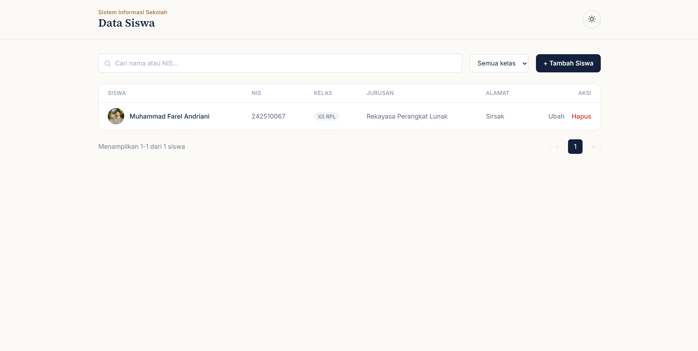
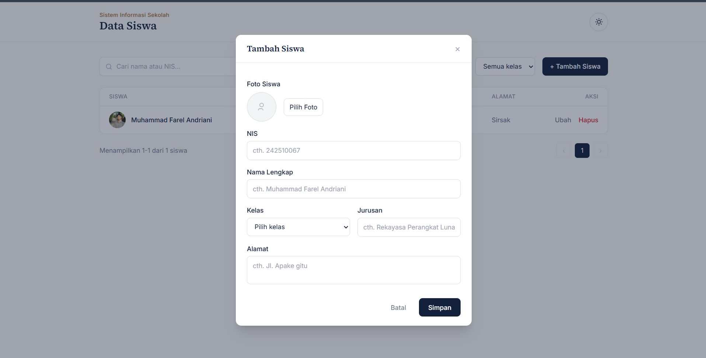
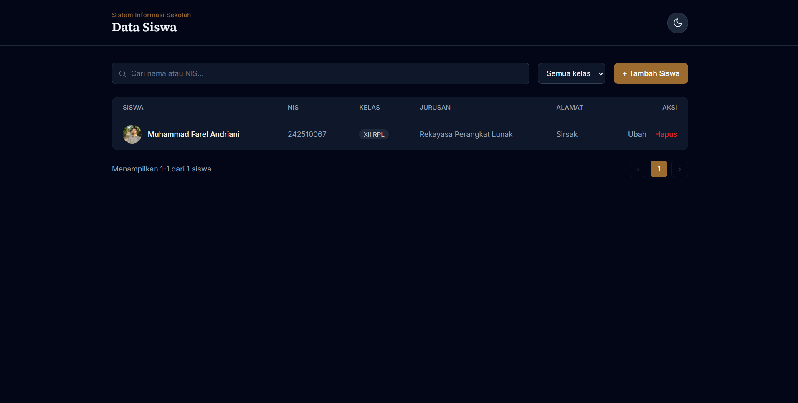
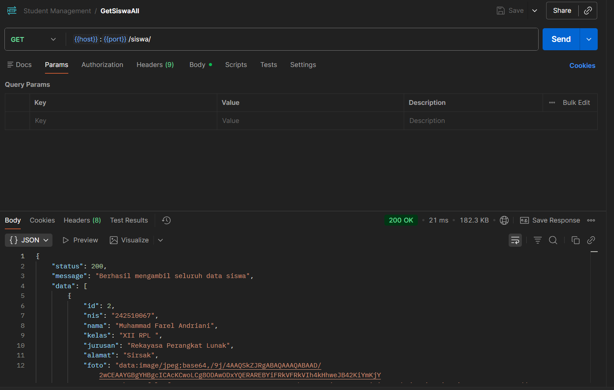
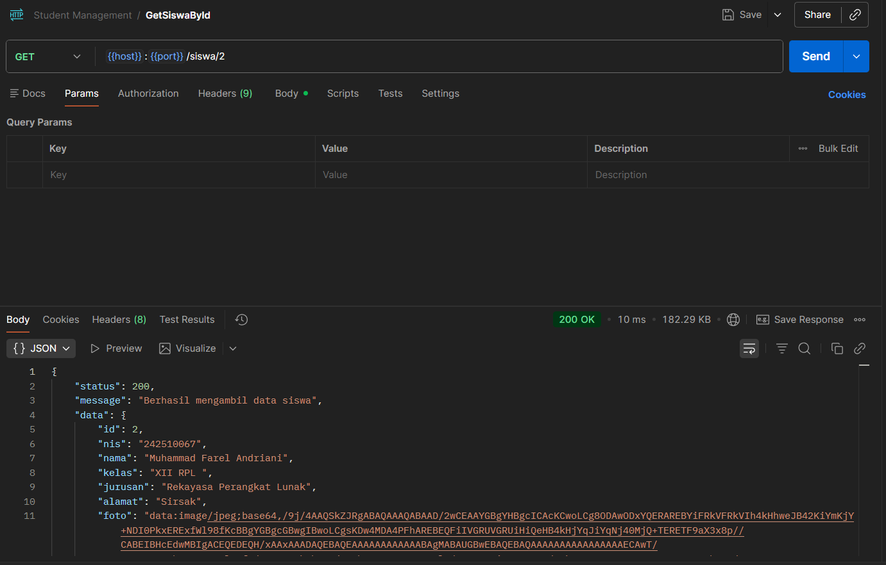
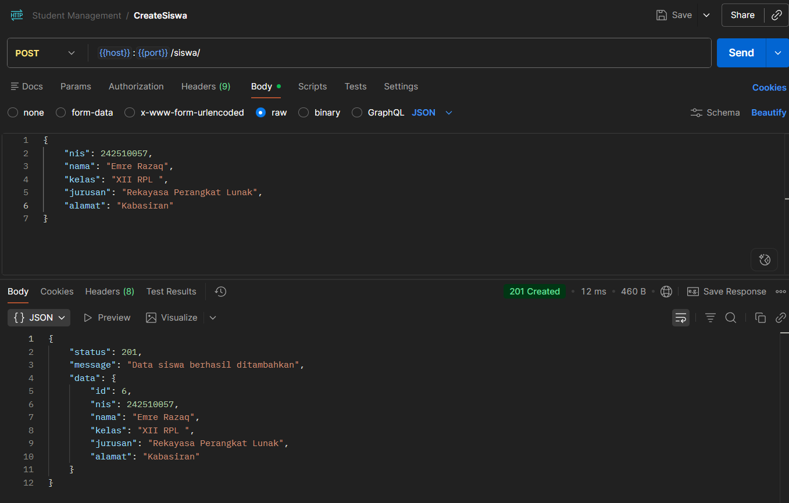
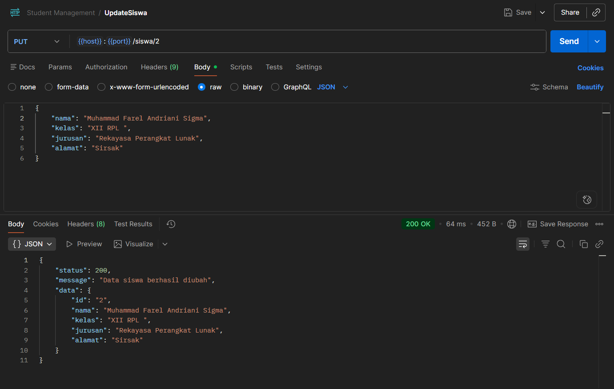
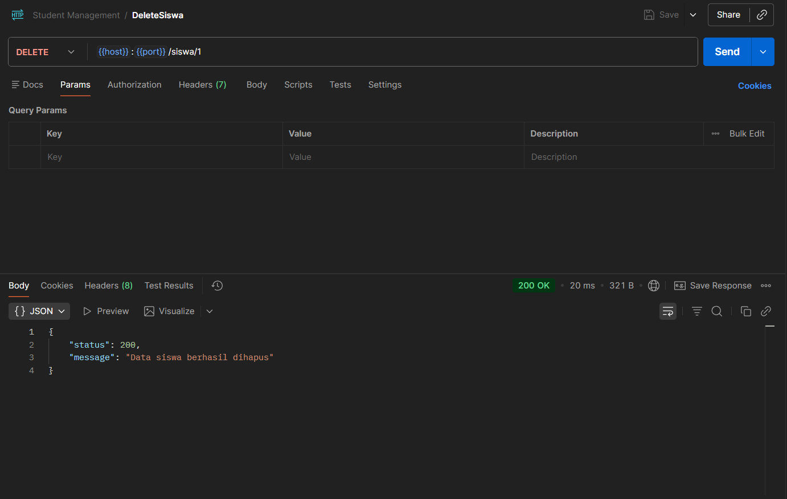

# Student Management REST API

## 1. Deskripsi Aplikasi

Student Management REST API adalah aplikasi manajemen data siswa berbasis REST API yang memungkinkan pengguna untuk melakukan operasi **Create, Read, Update, dan Delete (CRUD)** terhadap data siswa. Aplikasi ini dilengkapi dengan fitur autentikasi, pencarian, filter berdasarkan kelas, pagination, upload foto siswa, dan validasi form pada sisi frontend.

## 2. Teknologi yang Digunakan

**Backend:**
- Node.js
- Express.js
- MySQL (mysql2)
- CORS

**Frontend:**
- HTML5
- Tailwind CSS (via CDN)
- JavaScript (Vanilla JS)

**Tools Pendukung:**
- Postman  (testing API)
- Live Server (menjalankan frontend)

## 3. Cara Menjalankan Backend

1. Clone repository ini:
   ```bash
   git clone https://github.com/MUFArd/student-management-rest-api.git
   cd student-management-rest-api
   ```

2. Install dependency:
   ```bash
   npm install
   ```

3. Buat database MySQL dan import struktur tabel `siswa` (lihat file `.sql` yang disediakan, atau jalankan query berikut):
   ```sql
   CREATE TABLE `siswa` (
       `id` INT(10) NOT NULL AUTO_INCREMENT,
       `nis` INT(10) NOT NULL,
       `nama` VARCHAR(50) NOT NULL,
       `kelas` VARCHAR(50) NOT NULL,
       `jurusan` VARCHAR(50) NOT NULL,
       `alamat` VARCHAR(50) NOT NULL,
       `foto` LONGTEXT NULL,
       `created_at` TIMESTAMP NOT NULL DEFAULT CURRENT_TIMESTAMP,
       PRIMARY KEY (`id`),
       UNIQUE KEY `nis` (`nis`)
   );
   ```

4. Atur koneksi database di `config/database.js` sesuai kredensial MySQL kamu (host, user, password, nama database).

5. Jalankan server:
   ```bash
   node server.js
   ```
   atau, jika menggunakan nodemon:
   ```bash
   npx nodemon server.js
   ```

6. Server akan berjalan di:
   ```
   http://localhost:3000
   ```

## 4. Cara Menjalankan Frontend

1. Masuk ke folder page.
2. Buka file `index.html` menggunakan ekstensi **Live Server** di VS Code, atau buka langsung lewat browser.
3. Pastikan `API_BASE` di file `script.js` sudah sesuai dengan alamat backend:
   ```js
   const API_BASE = 'http://localhost:3000/siswa';
   ```
4. Frontend akan otomatis terhubung ke backend selama server backend sudah berjalan.

## 5. Daftar Endpoint API

| Method | Endpoint       | Deskripsi                          
|--------|----------------|-------------------------------------
| GET    | `/siswa`       | Mengambil seluruh data siswa        
| GET    | `/siswa/:id`   | Mengambil data siswa berdasarkan ID 
| POST   | `/siswa`       | Menambahkan data siswa baru         
| PUT    | `/siswa/:id`   | Mengubah data siswa                 
| DELETE | `/siswa/:id`   | Menghapus data siswa                
**Contoh Body Request (POST/PUT `/siswa`):**
```json
{
    "nis": 242510067,
    "nama": "Muhammad Farel Andriani",
    "kelas": "XII RPL",
    "jurusan": "Rekayasa Perangkat Lunak",
    "alamat": "Sirsak",
    "foto": "data:image/png;base64,..."
}
```

## 6. Screenshot Aplikasi

**Halaman Daftar Siswa**


**Form Tambah/Ubah Siswa**


**Mode Gelap**



## 7. Identitas Pembuat

- **Nama:** Muhammad Farel Andriani
- **Kelas:** 12 RPL
- **Jurusan:** Rekayasa Perangkat Lunak
- **Proyek:** Tugas REST API — Student Management System

---

## OUTPUT

- **Link Github:** https://github.com/MUFArd/student-management-rest-api
- **Screenshot FrontEnd:** 


- **Screenshot Pengujian REST API:**







